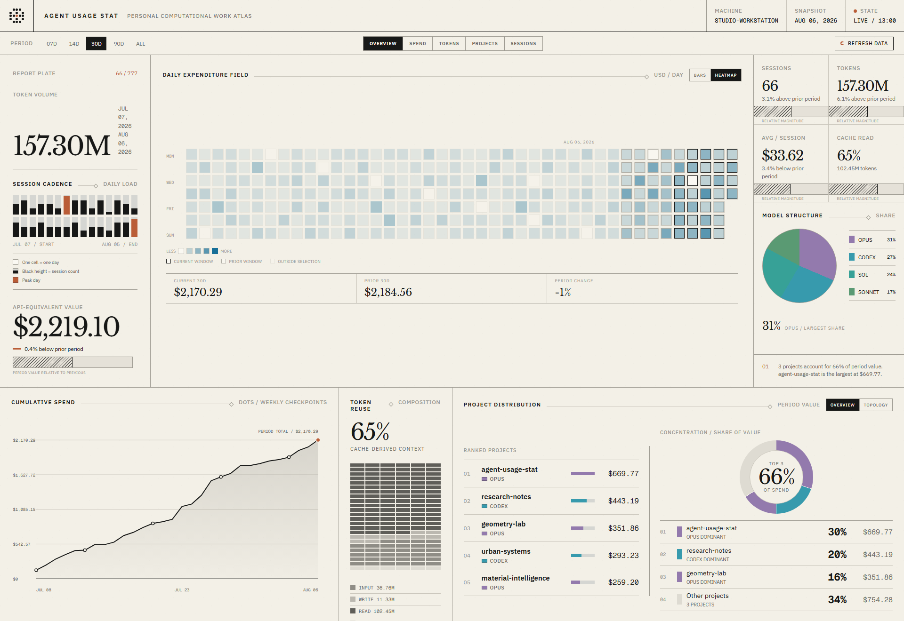

# Agent Usage Stat

A private, local portal for understanding how your coding agents use tokens, time, and API-equivalent cost.



## Supported

Agent Usage Stat supports:

- Windows and macOS
- Claude Code
- OpenAI Codex, including Codex sessions used through ChatGPT

It does not read general ChatGPT chats, Claude.ai chats, Linux sessions, or API-account usage. All data stays on your machine or in the folder you choose.

## Start

Node.js 20 or newer is required.

1. [Download or clone this repository](https://github.com/yiliangs/agent-usage-stat).
2. On Windows, double-click `Initialize-Agent-Usage-Stat.bat`. On macOS, double-click `Initialize-Agent-Usage-Stat.command`.
3. Choose the folder where usage data should be stored.

That folder is the only setting. The initializer detects the operating system and installed agents, installs a private runtime under your user profile, connects Claude Code and Codex automatically, and opens the portal.

Codex requires one security confirmation before it can run a new hook. If Codex asks, open `/hooks` and trust the Agent Usage Stat hook. This confirmation cannot be completed by the initializer.

Open a new terminal after setup. The normal `claude`, `codex`, and `claudex`
commands then print one verified status line after the agent exits:

```text
[Agent Usage Stat] Usage recorded: Claude, 18.6M tokens, $42.68, my-project
```

The line appears in the same terminal, not in a popup. It is printed only after
the detached capture worker has completed its shard write and read-back check.
Use `agent-usage-stat setup --no-terminal-message` to keep silent capture without
shell command wrappers. The explicit fallback is
`agent-usage-stat run claude -- <arguments>`, with `codex` or `claudex` accepted
in place of `claude`.

The portal runs at `http://127.0.0.1:4179`. Its **Refresh data** button scans
local Claude and Codex transcripts, reconciles changed sessions into the configured
`logbook.d/`, rebuilds the browser snapshot, and reloads the updated view.

On Windows, keep the portal available after login with:

```bash
aus portal enable
```

Use `aus portal status` or `aus portal disable` to inspect or disable login
startup. Disabling startup leaves the currently running portal available until it
is stopped or the user logs out. The dedicated launchers remain safe fallbacks:
`portal/Agent-Usage-Stat.bat` on Windows and `portal/Agent-Usage-Stat.command`
on macOS. If the server is already running, the launcher only opens it; otherwise,
it starts a foreground server.

## What you get

- Spend and token trends
- Claude Code and Codex comparisons
- Model, project, machine, and session breakdowns
- Cache read and write efficiency
- Searchable session details

Costs are API-equivalent list-price estimates. They are not charges added to a ChatGPT or Claude subscription.

Each completed session becomes one JSON file under `<your-folder>/logbook.d/`. You can use a synced folder to combine several Windows and macOS machines.

## Terminal alternative

From a source checkout, link the short `aus` command once:

```bash
npm link
aus setup
aus
```

`aus` and `aus portal` both open the portal. The full `agent-usage-stat` command
remains available for scripts and compatibility. `setup` asks for the data folder
only. To change it later:

```bash
aus config --set dataRoot="<new-folder>"
```

## Development

```bash
npm install
npm install --prefix portal
npm test
```

Licensed under MIT.
