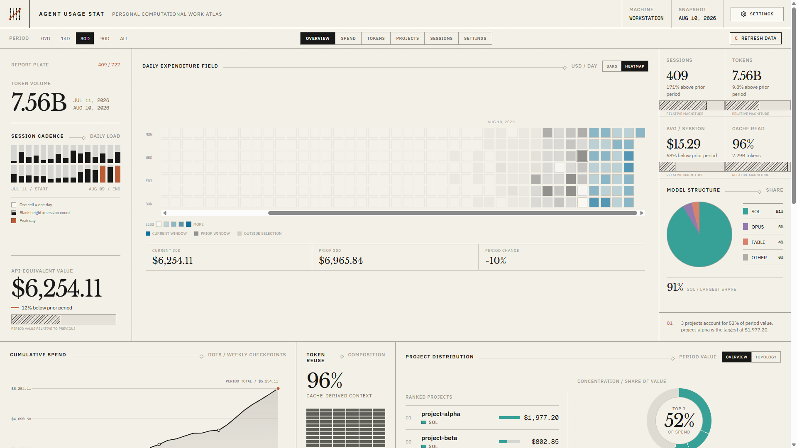
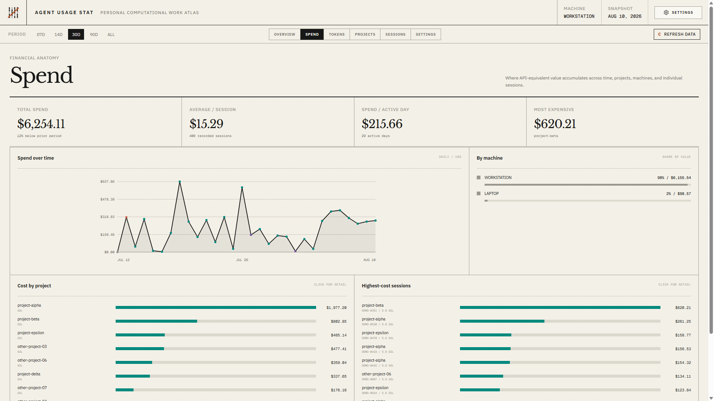
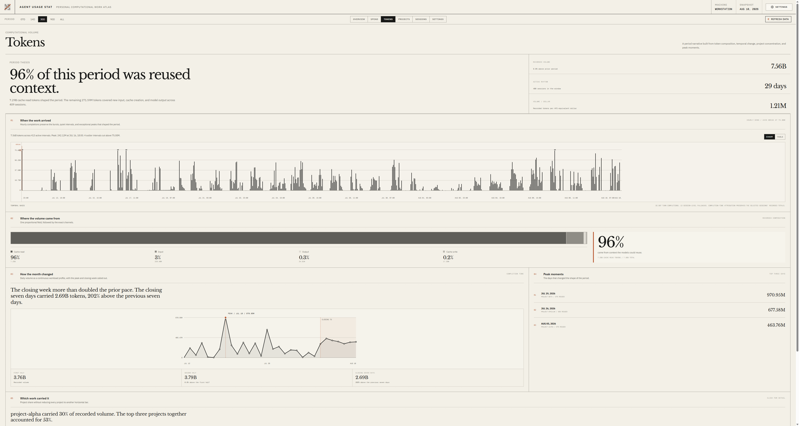
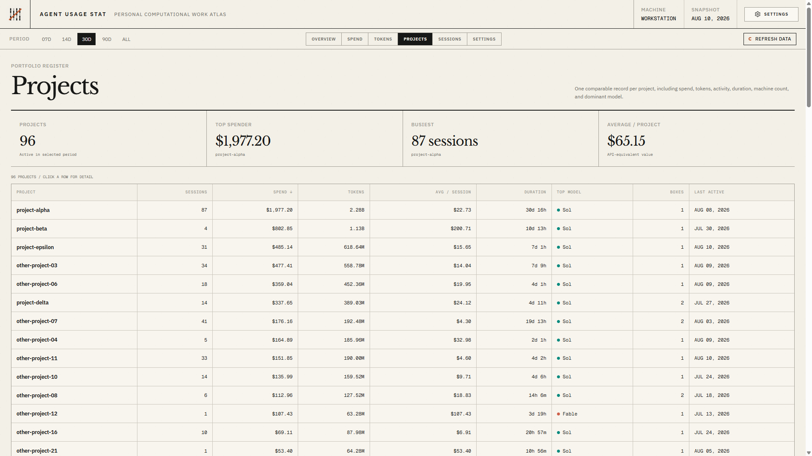
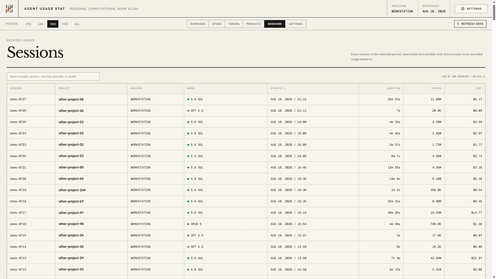
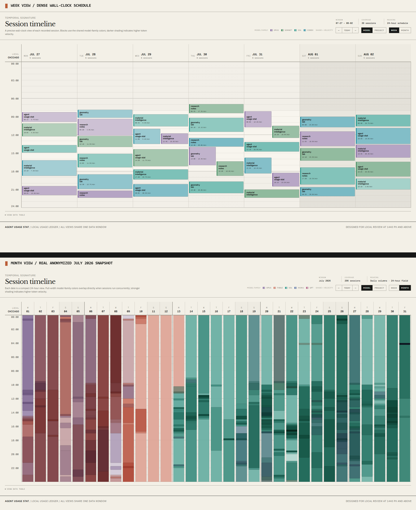

# Agent Usage Stat

A private desktop analytics app for understanding how Claude Code, OpenAI Codex, and GitHub Copilot CLI use tokens, time, and API-equivalent cost.

Agent Usage Stat turns local coding-agent transcripts into one searchable usage ledger. Compare providers and models, follow spend and token volume, inspect projects and sessions, and see when work happened. Prompt and response text never enters the ledger.



## Supported

- Windows and macOS
- Claude Code
- OpenAI Codex, including Codex sessions used through ChatGPT
- GitHub Copilot CLI

Agent Usage Stat does not read general ChatGPT or Claude.ai chats. All usage data stays on the local machine or in the folder selected by the user.

## Install

Download the current installer from [GitHub Releases](https://github.com/yiliangs/agent-usage-stat/releases):

- Windows installer: `Agent-Usage-Stat-Setup.exe`
- Windows portable: `Agent Usage Stat-win32-x64-*.zip`
- macOS: `Agent-Usage-Stat.dmg`

No separate Node.js or npm installation is required.

On first launch, choose where to keep the durable usage ledger and how sessions should be captured. Agent Usage Stat then reconciles existing sessions and opens the dashboard. The recommended local ledger is `%LOCALAPPDATA%\Agent Usage Stat\ledger` on Windows and `~/Library/Application Support/Agent Usage Stat/ledger` on macOS.

To combine usage from multiple computers, choose a folder in Google Drive, OneDrive, Dropbox, or another synchronized drive, then select the corresponding local folder on each computer.

## Explore the data

Every view uses the same date window, so cost, token, project, and session totals stay comparable as you move through the app.

- **Spend:** Follow API-equivalent value across time, projects, machines, and individual sessions.
- **Tokens:** Inspect token traffic, daily volume, composition, and cache effectiveness.
- **Projects:** Compare spend, tokens, duration, machine count, activity, and dominant model by project.
- **Sessions:** Search and sort every recorded session, then open its usage anatomy for detail.









Recorded sessions also have a wall-clock timeline, as a dense week schedule and as a compact month field. Blocks carry the shared model-family colours, and stronger shading indicates higher token velocity.



## Data and privacy

Each completed session becomes one JSON file under `<data-root>/logbook.d/`. This ledger is the only spend source and can be synchronized across Windows and macOS machines.

The ledger contains usage totals, model names, project names, branches, machine names, and local project paths. It does not contain prompt or response text. Parsing and dashboard caches remain local and disposable.

Costs are API-equivalent list-price estimates. They are not charges added to a ChatGPT, Claude, or Copilot subscription.

## Capture and settings

Continuous capture is recommended. It installs best-effort hooks for detected agents so usage can be checkpointed while the application is closed. Opening the application and choosing **Sync now** also reconciles every discoverable transcript. Codex requires one security confirmation after its hook is first installed: open `/hooks` in Codex and trust the Agent Usage Stat hook when prompted.

Batch sync installs no Agent Usage Stat hooks. It reconciles discoverable local transcripts whenever the application opens or **Sync now** is selected, but it cannot recover a session deleted by an agent before the next sync.

Settings reports the last hook attempt and the last successful checkpoint separately. The default capture policy and per-agent overrides can be changed at any time. Changing the ledger folder merges existing history into the selected ledger without replacing newer records, and preserves the original ledger as a backup by default.

Advanced agent locations normally resolve from `CLAUDE_CONFIG_DIR`, `CODEX_HOME`, and `COPILOT_HOME`, then fall back to each provider's standard per-user directory. Explicit overrides only change where Agent Usage Stat scans and manages its hook. They never move or delete provider-owned data.

## Application architecture

```text
Claude / Codex / Copilot hooks (continuous policy, best effort)
  -> installed standalone helper
  -> provider-specific transcript parser and pricing
  -> logbook.d/<session-id>.json

Provider transcript discovery (all modes)
  -> launch / refresh reconciliation
  -> logbook.d/<session-id>.json

Agent Usage Stat desktop application
  -> Electron lifecycle and user workflows
  -> HelperRuntime -> stable installed helper
  -> PortalRuntime -> generated snapshot -> aus:// renderer
```

The production application opens no localhost server. The sandboxed renderer reads packaged assets and generated data through the `aus://` application protocol.

## Development

Node.js 20 or newer is required for development only.

```bash
npm install
npm test
npm run test:desktop
npm start
npm run make
```

- `npm test` runs the core and portal regression suite.
- `npm run test:desktop` packages the application and exercises the standalone helper, first-run hook installation, custom protocol, refresh, and renderer.
- `npm start` builds and launches the development desktop application.
- `npm run make` creates platform installers under `dist/forge/make/`.

Tagged releases are built for Windows and macOS by `.github/workflows/desktop-release.yml`. Published releases require signing credentials. Local `npm run make` artifacts are unsigned development builds; published releases are signed, and macOS releases are notarized.

The npm package does not expose a supported JavaScript library API.

Licensed under MIT.
